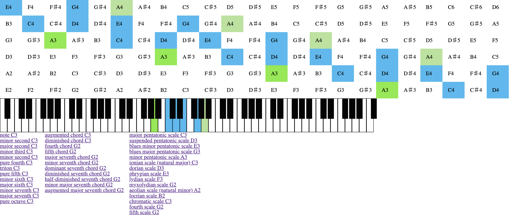

# Consonance

Guitar fretboard assistant


# Roadmap for MVP
- [x] Simplest fretboard
- [x] Intervals, chords, scales
- [x] Routing
- [ ] Advanced chords
- [ ] Inversions of chords
- [ ] Chord forms
- [ ] Training mode

## How to run locally
### Docker way
To build
```bash
./scripts/build.sh
```

To start
```bash
./scripts/run.sh
```

To stop
```bash
./scripts/stop.sh
```

To restart
```bash
./scripts/restart.sh
```

### Debug way
1. Install elm, elm-format and elm-test by following
    ```
    brew install elm
    brew install elm-format
    npm install -g elm-test
    npm install -g elm-live
    ```
2. `./scripts/debug.run.sh`
